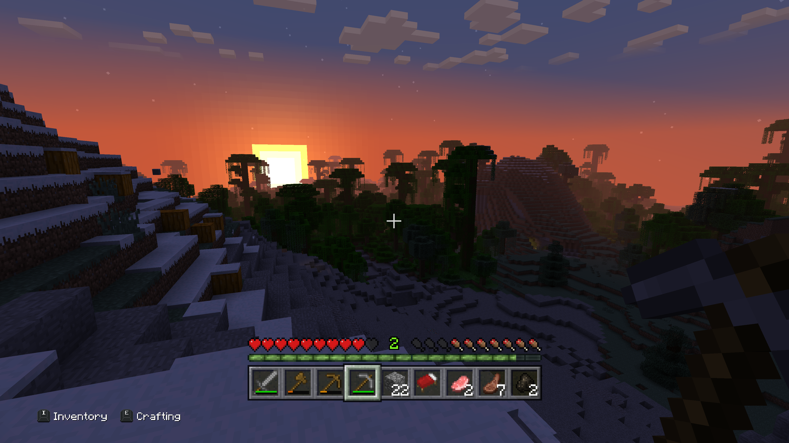
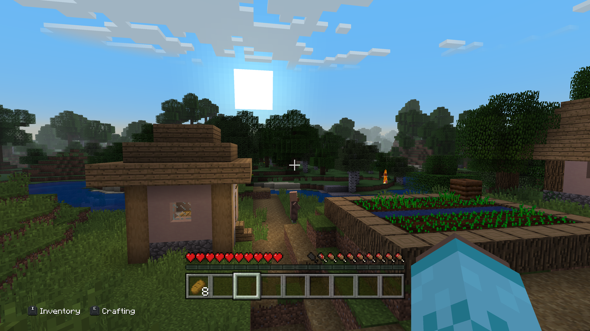
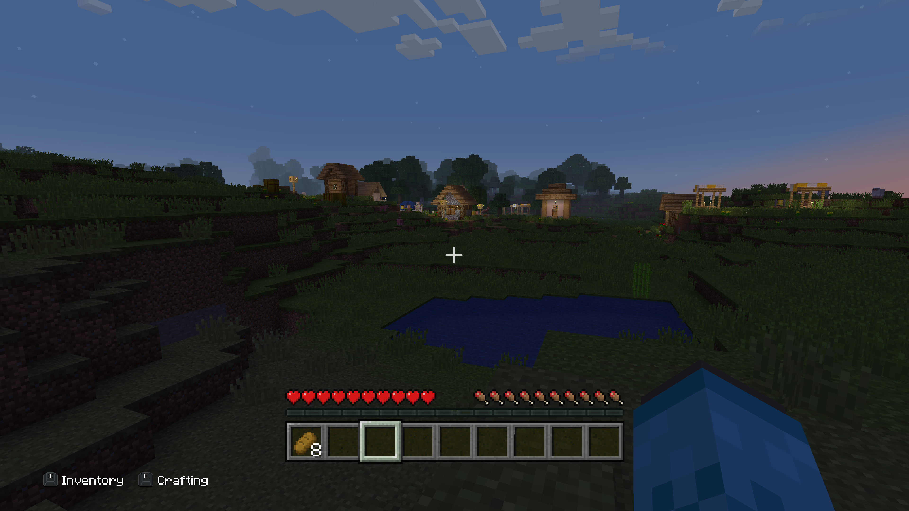

Legacy4Java is an extremely passionate mod made by Wilyicaro, which reimplements Minecraft's classic console edition features from the likes of Playstation and Xbox to modern versions of Java!

<iframe width="560" height="315"
src="https://www.youtube-nocookie.com/embed/kMQFDXU8mNM"
frameborder="0"
allow="autoplay; encrypted-media; picture-in-picture"
allowfullscreen></iframe>

# Reimplementing console features to Java
***
Legacy4J reimplements every feature of 4J Studios' Minecraft into Java Edition. It encompasses all the interfaces from the console edition, including texture packs such as the iconic plastic texture pack, as well as all the small details such as the loading screen having the same day/night position as the current world you're loading in has!

Not to be overlooked are the tutorial worlds - each one faithfully recreated/ported into Legacy4J!

This makes me excited to play Minecraft again! And, in my opinion, is one of the best ways to experience Minecraft portably on the Steam Deck!

# Some other neat stuff
***
## Kyubion Studios partnered with Wilyicaro
And made a modpack that builds on top of Legacy4Java, providing one of the best ways to experience what Minecraft objectively should've been.
[https://modrinth.com/modpack/legacy-minecraft](https://modrinth.com/modpack/legacy-minecraft)

## Classic Xbox 360 Skins!
You can download all of them [here!](https://cloud.disroot.org/s/gaczXMeGnT2ydqN)

## Classic world generation
When you mix Legacy4Java with [Moderner Beta](https://modrinth.com/mod/moderner-beta), which is a terrain generation mod, it is the coolest Minecraft experience I'm sure you'll ever have. There are a ton of world generation presets that come with this mod, such as choosing 1.12.2 world generation, or 1.2.5, Infdev, 1.6.4, and so many more. You can even choose presets that mix modern Minecraft with the old terrain generation! My favorite preset is the release hybrid, which has the terrain generation of Minecraft 1.6.4 but with most vanilla biomes and structures! It's really cool!

## Modded spins of Legacy Edition

Because it's Java Edition, you can add any texture packs or mods you want! People have already started making their own really cool mod packs based on Re-Console and Legacy4Java alike, and they're very interesting spins on 4J Studios' Minecraft that I highly recommend checking out!
[https://github.com/contrarybaton60/Williams-Console](https://github.com/contrarybaton60/Williams-Console)

## Cool community screenshots I Found

# I hope this post finds you well. Please take care of yourself.

